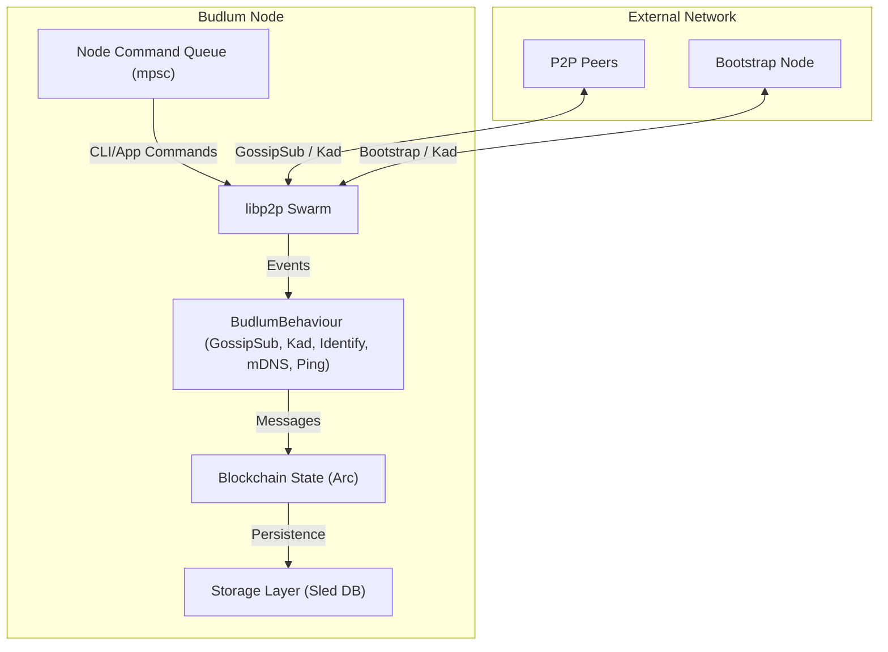

# Budlum Blockchain

A high-performance, decentralized blockchain implementation in Rust, focusing on scalability and robust P2P networking.

## Features

- **P2P Networking**: Powered by `libp2p`.
  - **Kademlia DHT**: Decentralized peer discovery across different networks.
  - **Identify Protocol**: Self-discovery of public IP addresses for NAT traversal.
  - **GossipSub**: Efficient broadcast of blocks and transactions.
  - **mDNS**: Automatic local network discovery.
- **Persistence**: Embedded `sled` database for high-performance block storage.
- **Synchronization**: Automatic chain synchronization upon connection.
- **Modular Design**: Separated core logic, networking, and storage layers.

## Architecture

Budlum follows a modular architecture designed for decentralization and low latency.



### Core Components

1.  **Blockchain (`src/blockchain.rs`)**: Manages the chain state, validates blocks/transactions, and handles chain replacement (longest chain rule).
2.  **Networking (`src/network/node.rs`)**: Manages the standard `libp2p` stack. It handles peer discovery via Kademlia and message propagation via GossipSub.
3.  **Storage (`src/storage.rs`)**: A persistent layer using `sled` to ensure data survives node restarts.
4.  **Protocol (`src/network/protocol.rs`)**: Defines the binary communication protocol for `GetBlocks`, `Chain`, `Block`, and `Transaction` messages.

## Getting Started

### Prerequisites

- [Rust](https://www.rust-lang.org/tools/install) (latest stable version)

### Building

```bash
cargo build --release
```

### Running

Start the first node (Bootstrap node):
```bash
cargo run -- --port 4001 --db-path node1_db
```

Start another node and connect to the bootstrap node:
```bash
cargo run -- --port 4002 --db-path node2_db --bootstrap /ip4/127.0.0.1/tcp/4001/p2p/<PEER_ID_OF_NODE_1>
```

## CLI Usage

| Argument | Description | Default |
| :--- | :--- | :--- |
| `--port` | Port to listen on for incoming connections | `4001` |
| `--db-path` | Path to the `sled` database directory | `budlum_db` |
| `--bootstrap` | Multiaddr of a bootstrap node to join the network | (None) |
| `--dial` | Multiaddr of a peer to connect to directly | (None) |

## Implementation Progress

- [x] Basic Blockchain Structure (Blocks, Transactions, Hashing)
- [x] P2P Networking (libp2p, GossipSub, mDNS)
- [x] Chain Synchronization Logic
- [x] Persistence (Sled Database)
- [x] Decentralized Peer Discovery (Kademlia DHT)
- [ ] Wallet & Cryptographic Signatures (Upcoming)
- [ ] Proof of Work Mining Algorithm (Upcoming)
